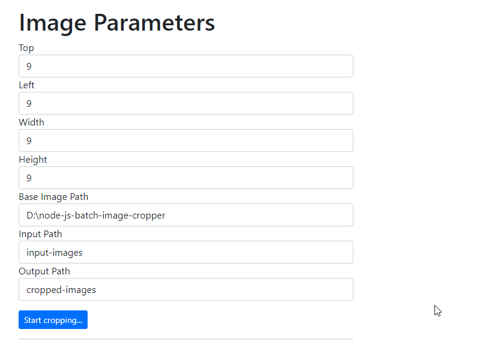
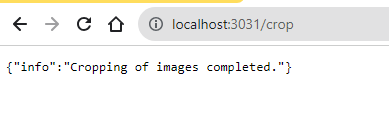
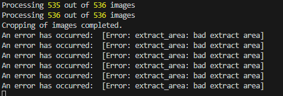

# Batch Image Cropper on Node.js with sharp package

This is a simple project to enable you crop multiple images in a folder which have the same dimensions.

## Description

Crop all those screenshots which to remove some portions such as identifiable info on your computer screen before sharing publicly. This uses the [sharp package](https://www.npmjs.com/package/sharp). This is part of my learning Node and I wanted to experiment.

## Getting Started

### Dependencies

- You need Node installed in your environment
- npm packages required: express, sharp, morgan-body and nodemon (for dev auto-restart)

### Installing

- Just clone the repo or download from this repo
- Copy to a directory in your computer.

### Executing program

- Install all the dependencies as shown above by running commands below

```
npm init -y
```

If any dependency is not installed, you can install as below:

```
- npm install express sharp morgan-body
- npm install --save-dev nodemon
```

Start the application using the normal npm commands:

```
npm start
```

On the browser, navigate to http://localhost:3031/ and input the parameters as shown below and click "Start cropping..." button.



On your browser window, you will get the below output:



On the console, you will get the below output:



## Improvements

The project needs to improve in the following:

- ~~Connect to a front-end (React) for input of the parameters such as path, image cropping dimensions etc. DONE~~
- ~~Better error handling~~
- ~~Organize the project better with folders etc.~~
- ~~Additional functionality:~~
  - ~~Start and stop the application processing~~
  - ~~Choose the path. Directory picker browser support is scanty for now. Implement later.~~
  - ~~Choose whether to delete the original files etc.~~

## Help

If you get errors when processing, check the following:

- The image path exists
- The dimensions are correct. I used MS Paint to determine the start and the dimensions of the cropped image.

## Authors

[Munene Isaka](https://github.com/muneneisaka)

## Version History

- 1.0.0

  - Initial release
  - See [commit change]()

- 1.1.0
  - Added front-end features

## License

This project is licensed under the MIT License.

## Acknowledgments

Inspiration, code snippets, etc.

- [How to Process Images in Node.js with Sharp | Digital Ocean](https://www.digitalocean.com/community/tutorials/how-to-process-images-in-node-js-with-sharp)
- [How to Crop Images in Node.js](https://usefulangle.com/post/104/nodejs-crop-image)
- [express](https://www.npmjs.com/package/express)
- [sharp](https://www.npmjs.com/package/sharp)
- [nodemon](https://www.npmjs.com/package/nodemon)
